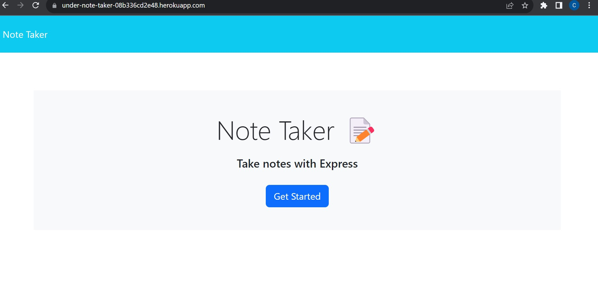
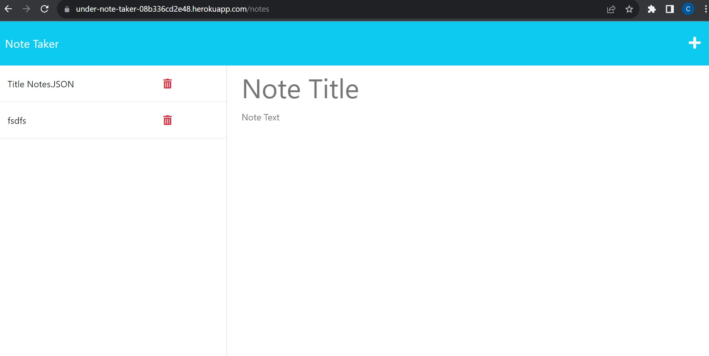
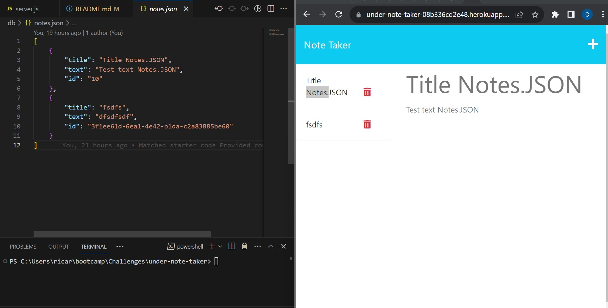

  # Under-Note-Taker
  
  
  
  ## Description 
  Bootcamp Challenge 11 for Express.js.  The motivation for this project is to help develop an application that can help record my notes. I built this application to learn how to utilize Express.js to code the backend server communication and updating databases that the server is readingg from. The project helps solve the problem  by connecting the the client side  to a new backend server while utilizing the skills of modulization/helpers/middleware scripts to support feedback  throughout the process of web development.  From this project  I learend the importance of helpers, middleware, routees scripts. Utilizing Insominia to troubleshoot was a huge skill for understanding Express.js and built up my confidence with Front-end and Back-end servers.

  ## Table of Content
  [Description](#description) 
  [Installation](#installation) 
  [Usage](#usage) 
  [License](#license) 
  [Contribution](#contribution) 
  [Test](#test) 
  [Questions](#questions) 

  ## Installation
  N/A
  
  ## Usage

  Here is the link to the heroku app that demostrates this: 
  Heroku: [under-note-taker](https://under-note-taker-08b336cd2e48.herokuapp.com/)

  ## License
    This project utilize this MIT.
  
  ## Contribution
  Please communicate with me through Github so I can understand what contribution you would like to do. Thank you.
  
  ## Test

  **Example of HEROKU app deployment for the Home page with HerokuURL:**  
  
  **Example of HEROKU app deployment for the Notes page with HerokuURL:**  
  
  **Example of HEROKU app deployment for database and app relationship comparison with HerokuURL:**  
  

 
  ## Questions
  Thank you again for reviewing this README.md.  
  If you have additional questions please feel free to email me and feel free to check out my other repos.  
  GitHub: [Chasqui10](https://github.com/Chasqui10)  
  Email:  [chasqui.rmf@gmail.com](chasqui.rmf@gmail.com) 
